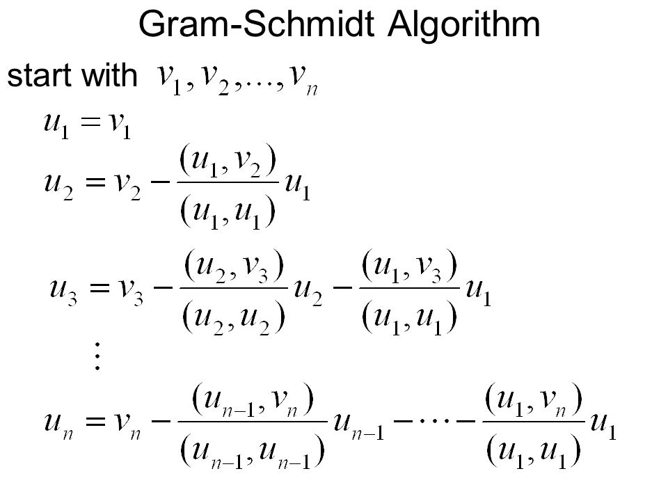
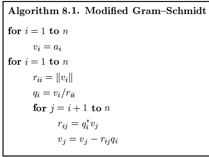
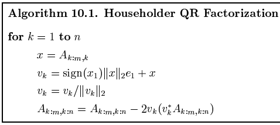

<h1 align="center">
     
    
Algorithms to calculate the QR factorization of a matrix

</h1>

 
 

 
 

 

<h2 align="center">
     
    
QR Factorization

</h2>
 
If A is an m x n matrix with linearly independent columns, 
then A can be factored as A = QR where Q is an m x n 
matrix whose columns form an orthonormal basis for Col A  
and R is an n x n upper triangular invertible matrix with 
positive entries on its diagonal 

To find R, observe that QTQ = I because columns of Q are orthonormal 

